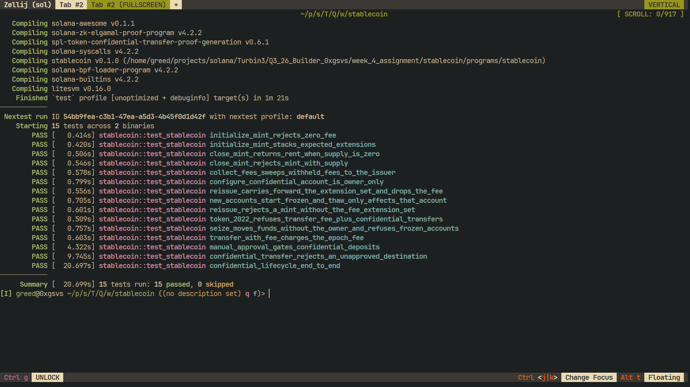

# Remittance Stablecoin (token-2022)

A remittance stablecoin built on token-2022 with four mint-level extensions doing
real work — a protocol fee on every transfer, frozen-by-default accounts that the
issuer thaws after KYC, on-chain metadata so wallets do not need an off-chain
registry, and a mint close authority for decommissioning — plus the confidential
re-issue that regulators and users pushed for: a permanent delegate (seizure) and
confidential transfers with manual approval.

Program ID (localnet): `J4YPy3eboDrRJ1cnta5H7UZ36TVY9CwzFikCs1TGeau`

## The two mints

**Fee mint** (`InitializeMint`) stacks, in this order — every extension-init
instruction runs *before* `InitializeMint`, because token-2022 only accepts
extensions that exist when a mint is initialized:

| extension | why |
| --- | --- |
| `TransferFeeConfig` | protocol-level fee on every transfer (issuer revenue) |
| `MetadataPointer` (`metadata_address = mint`) | wallets read name/symbol/uri from the mint itself |
| `DefaultAccountState = Frozen` | a brand new account can move nothing until KYC clears |
| `MintCloseAuthority` | the mint can be decommissioned |

The account is sized with
`ExtensionType::try_calculate_account_len::<Mint>(&[...])`. That length has to be
*exact* (`InitializeMint` compares it against the extension set it finds), so the
variable-length `TokenMetadata` entry that `Initialize` appends **after**
`InitializeMint` is not allocated up front — the mint account is created with
exact space and funded for the extra rent, and token-2022 `resize`s it when the
metadata is written.

**Confidential mint** (`ReissueMint`) is a new mint carrying the same metadata
pointer, default account state and close authority forward, plus:

- `PermanentDelegate` — the seizure authority; and
- `ConfidentialTransferMint` with `auto_approve_new_accounts = false`, i.e.
  `approve_policy = manual`.

It does **not** carry `TransferFeeConfig`. That is the gap (see below), and the
program writes the whole comparison on-chain in a `ReissueRecord` PDA:
`previous`, `new`, `carried_forward`, `added`, `dropped`.

## Instructions

| instruction | what it does |
| --- | --- |
| `initialize_mint` | creates the fee mint: metadata pointer → default account state → close authority → transfer fee → `InitializeMint2` → on-chain metadata |
| `create_token_account` | permissionless account creation, with space reserved for `TransferFeeAmount` (required by the fee mint) and `ConfidentialTransferAccount` |
| `mint_to` | issuance by the mint authority |
| `thaw_account` | **KYC path**: the freeze authority thaws one account; the mint's default state is never touched, so later accounts still start frozen |
| `freeze_account` | re-freezes a single account (sanctions, compromised wallet) |
| `transfer_with_fee` | computes the fee with `calculate_epoch_fee(current_epoch, amount)` from the live `TransferFeeConfig` and transfers with `transfer_checked_with_fee` |
| `collect_fees` | harvests withheld fees from the accounts named as remaining accounts and withdraws them to the issuer |
| `close_mint` | closes the mint through its close authority (requires zero supply) |
| `reissue_mint` | builds the confidential mint and records the extension-set gap |
| `seize` | moves tokens out of an account the owner did not consent to, using the permanent delegate |
| `configure_confidential_account` | owner-only `ConfigureAccount` with a `PubkeyValidity` proof of the account's AES key |
| `approve_confidential_account` | the `approve_policy = manual` half: the mint's confidential transfer authority clears a configured account |
| `deposit_confidential` | public balance → confidential pending balance |
| `apply_pending_balance` | pending → available (spendable) balance |
| `confidential_transfer` | confidential transfer, proven by three verified context state accounts |
| `withdraw_confidential` | **applies the pending balance first**, then converts confidential tokens back to public |

### Never a bare `transfer`

The public path only ever calls `transfer_checked_with_fee`. Plain `transfer` /
`transfer_checked` would move the tokens and quietly skip the fee the issuer is
owed, and the fee is recomputed from the mint's live config on every call rather
than cached, so a mid-epoch fee change cannot be smuggled past.

### State is only ever read through `StateWithExtensions`

Every mint or token-account read in `programs/stablecoin/src/extensions.rs` goes
through `StateWithExtensions::unpack` (never a raw `unpack`), including the
extension data: the fee config, the metadata pointer's target, the permanent
delegate, the confidential authority and the decoded `TokenMetadata`.
`anchor_spl::token_interface::{Mint, TokenAccount}` unpack through
`StateWithExtensions` as well, so the typed accounts in the instruction contexts
follow the same rule.

### `approve_policy = manual` is enforced by this program

token-2022 v11 writes `approved` when `ConfigureAccount` runs (from the mint's
`auto_approve_new_accounts`) and sets it in `ApproveAccount`, but **no token-2022
instruction reads it back**. A mint that wants manual approval therefore has to
enforce it itself, which is what `confidential_ready` /
`confidential_approved` do: `deposit_confidential`, `confidential_transfer`,
`apply_pending_balance` and `withdraw_confidential` all refuse an account the
issuer has not approved, and a confidential transfer refuses an *unapproved
destination* too.

## The gap between the two mints

Mint-level extensions are fixed at creation — token-2022 cannot add one to a live
mint — so "add confidential transfers and a seizure authority" means re-issuing
the mint. Carrying the fee across is where the requirement breaks. Every claim
below was read out of the token-2022 source; `FINDINGS.md` has the citations and
line references.

1. **`TransferFeeConfig` + `ConfidentialTransferMint` is rejected outright
   unless the mint also has `ConfidentialTransferFeeConfig`.** token-2022 checks
   this in `ExtensionType::check_for_invalid_mint_extension_combinations`
   (`InvalidExtensionCombination`), and the test
   `token_2022_refuses_transfer_fee_plus_confidential_transfers` reproduces it
   against the real program.
2. **Keeping the fee changes how confidential transfers work.** On a mint with a
   transfer fee, the token program does not accept a plain confidential
   `Transfer`: it demands the `TransferWithFee` proof set (equality +
   ciphertext validity + **fee sigma** + fee ciphertext validity + range, checked
   against a `withdraw_withheld_authority_elgamal_pubkey`), and the fee is
   withheld *inside* accounts as `ConfidentialTransferFeeAmount.withheld_amount`
   instead of being credited at transfer time. Issuer revenue stops being
   automatic and becomes a proof-carrying `WithdrawWithheldTokens` operation.
   That is why the re-issue drops the fee and the program refuses
   `confidential_transfer` on a fee-bearing mint
   (`ConfidentialTransferUnavailableWithTransferFee`).
3. **Seizure cannot reach confidential balances.** A confidential transfer needs
   the owner's ElGamal key pair *and* AES key to produce the proofs and the new
   decryptable balance, and the confidential instructions only accept the account
   owner as authority. `PermanentDelegate` therefore seizes the *public* balance
   only, and even then: token-2022 rejects a frozen source for every transfer,
   permanent delegate included, so the flow is thaw → seize → re-freeze.
4. **Accounts do not migrate.** The confidential extension needs space that the
   associated token account program does not allocate, and the AES/ElGamal keys
   are per account, so holders get new accounts and new keys — which is also why
   `ConfigureAccount` is deliberately owner-only while opening the account stays
   permissionless.
5. **Supply does not move.** The re-issue creates a mint, not a balance sheet:
   the issuer mints the migrated supply on the new mint and burns the old one
   (`close_mint` needs a zero supply) once everybody has moved.

`ReissueRecord` stores `carried_forward` / `added` / `dropped` on-chain so this
comparison is auditable rather than a README claim.

## Tests

```bash
anchor build
cargo nextest run
```

15 tests, run against the bundled token-2022 (11.0.0) and the ZK ElGamal proof
program inside LiteSVM:

- `initialize_mint_stacks_expected_extensions`, `initialize_mint_rejects_zero_fee`
- `new_accounts_start_frozen_and_thaw_only_affects_that_account`
- `transfer_with_fee_charges_the_epoch_fee`,
  `collect_fees_sweeps_withheld_fees_to_the_issuer`
- `close_mint_returns_rent_when_supply_is_zero`,
  `close_mint_rejects_mint_with_supply`
- `reissue_carries_forward_the_extension_set_and_drops_the_fee`,
  `reissue_rejects_a_mint_without_the_fee_extension_set`,
  `token_2022_refuses_transfer_fee_plus_confidential_transfers`
- `seize_moves_funds_without_the_owner_and_refuses_frozen_accounts`
- `configure_confidential_account_is_owner_only`,
  `manual_approval_gates_confidential_deposits`,
  `confidential_transfer_rejects_an_unapproved_destination`
- `confidential_lifecycle_end_to_end` — configure → approve → deposit → apply →
  confidential transfer → withdraw (which applies the pending balance), with the
  confidential balances decrypted from the on-chain ElGamal ciphertexts

The confidential tests generate the real proofs
(`spl-token-confidential-transfer-proof-generation`), have the ZK ElGamal proof
program verify each one into its own context state account, and pass those
accounts to the program — the same shape a production client uses, since a
transfer's proofs do not fit inline in one transaction.



## Layout

- `programs/stablecoin/src/lib.rs` — entrypoints
- `constants.rs` — seeds and fee constants
- `state.rs` — `ExtensionSet` (mint extension bookkeeping) and `ReissueRecord`
- `extensions.rs` — extension sets, account sizing, and every `StateWithExtensions` read
- `events.rs` — one event per instruction
- `instructions/*.rs` — one file per instruction
- `tests/test_stablecoin.rs` — LiteSVM tests
- `FINDINGS.md` — the token-2022 behaviours this program depends on, with source
  citations (extension-combination rules, the exact-length rule, why account
  space is reserved, why manual approval is enforced here, how proofs reach a
  CPI'd instruction)
