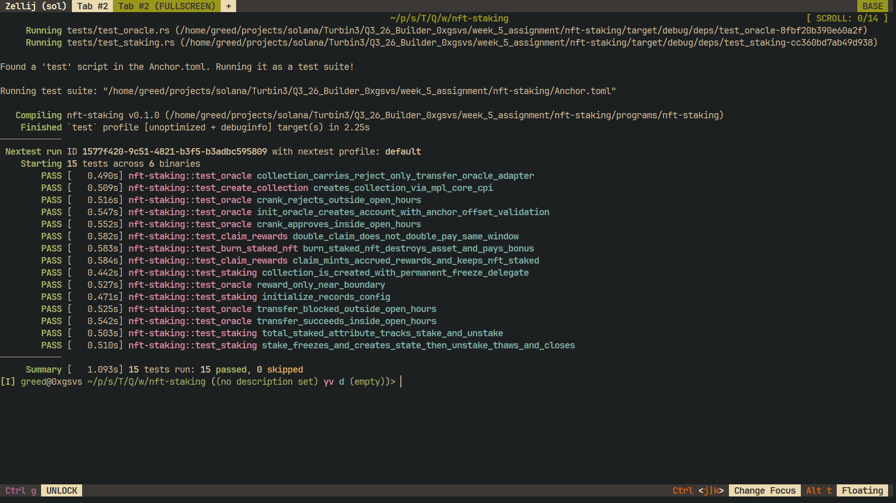

# nft-staking

Core NFT staking on Solana. Collections and assets live in
[Metaplex Core](https://developers.metaplex.com/core) (mpl-core); the staking
program wraps them with rewards, a burn-to-earn bonus, a collection-level
counter, and a time-windowed transfer gate driven by an on-chain oracle.

Built with Anchor 1.2 on top of mpl-core 0.12.

## Features

- **Staking** — freeze the asset through a permanent freeze delegate held by a
  program PDA. Unstaking thaws it and closes the stake account.
- **Rewards** — `claim_rewards` mints reward tokens without unstaking. Accrual
  is time-based; the NFT stays frozen and staked.
- **Burn-to-earn** — burn a staked NFT for a one-time bonus.
- **Collection stats** — a `total_staked` attribute on the collection tracks the
  number of staked assets.
- **Oracle transfer gate** — an mpl-core Oracle external plugin adapter rejects
  transfers outside a UTC open window. A permissionless crank updates it and is
  rewarded near the open/close boundaries.

## Layout

```
programs/nft-staking/
  src/
    lib.rs                 program entrypoints
    state.rs               Config, StakeState, Oracle, OracleVault
    constants.rs           PDA seeds and tuning constants
    error.rs               error codes
    helpers.rs             mpl-core Borsh account loaders
    instructions/          one handler per instruction
  tests/                   LiteSVM integration tests (one file per feature)
    common/mod.rs          shared test harness
    fixtures/              mpl-core program binary for LiteSVM
```

## Instructions

| Instruction | Purpose |
| --- | --- |
| `create_collection` | Create the mpl-core collection with freeze, attributes, and oracle plugins. |
| `create_asset` | Create an asset in the collection with freeze and burn delegates. |
| `initialize` | Create the config and reward mint for a collection. |
| `stake` | Freeze the asset and open a stake account. |
| `claim_rewards` | Mint accrued rewards; keeps the asset staked. |
| `burn_staked_nft` | Burn a staked asset for the one-time bonus. |
| `unstake` | Thaw the asset and close the stake account. |
| `init_oracle` | Create the per-collection oracle account and reward vault. |
| `update_oracle` | Permissionless crank that opens or closes the transfer window. |
| `transfer_asset` | Transfer an asset through mpl-core, gated by the oracle. |

## Reward math

`reward_bps` is a rate **per day**: a full `SECONDS_PER_PERIOD` (86,400 s) earns
`reward_bps` parts per 10,000 of `REWARD_UNIT` (1 mint base unit, 6 decimals).

```
amount = elapsed_seconds * reward_bps * REWARD_UNIT
         / SECONDS_PER_PERIOD
         / BPS_DENOMINATOR
```

`reward_bps` is bounded at 10,000 (100%) per period in `initialize`.

## Oracle transfer window

The oracle gates `Transfer`. Inside `[OPEN_HOUR, CLOSE_HOUR)` UTC the asset
transfers; outside it mpl-core rejects the lifecycle. `init_oracle` starts the
window closed so nothing slips through before the first crank. The crank is
permissionless and pays `ORACLE_REWARD` when it lands within
`BOUNDARY_TOLERANCE` seconds of either boundary, keeping `VAULT_MIN_LAMPORTS`
in the vault.

## Tests

Integration tests run against the real program binary in
[LiteSVM](https://github.com/LiteSVM/litesvm) — no validator needed.

```sh
cargo build-sbf          # build the program .so consumed by the tests
cargo nextest run        # or: cargo test
```



15 tests across 6 binaries cover collection creation, the full stake/unstake
lifecycle, reward accrual, burn-to-earn, the collection counter, and the oracle
transfer gate (open, closed, and boundary reward).